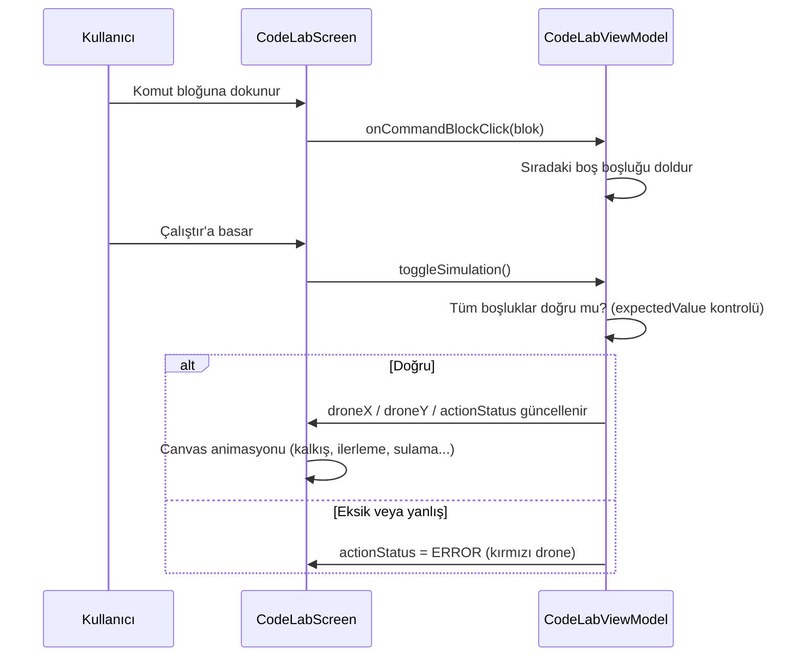

# NeuracodeAI_App

Neuracode AI Android uygulaması — Kotlin + Jetpack Compose ile geliştirilen, tarım temalı Python öğrenme platformu. Üst düzey repo dokümantasyonu için [kök README](../README.md)'ye bakın.

## Derleme ve Çalıştırma

Gereksinimler: JDK 17, Android SDK 35 (`compileSdk`), Android Studio önerilir.

```bash
# Windows
gradlew.bat assembleDebug

# macOS / Linux
./gradlew assembleDebug
```

- Debug APK: `app/build/outputs/apk/debug/`
- Uygulama `minSdk 24` (Android 7.0+) hedefler ve **yatay (landscape) moda** kilitlidir.

## Paket Yapısı

```
com.neuracode.ai/
├── MainActivity.kt              # Tek Activity, CompositionLocal ile AppSettings enjeksiyonu
├── data/
│   └── LessonRepository.kt      # 13 bölüm / 15 derslik statik müfredat
└── ui/
    ├── navigation/
    │   ├── Screen.kt            # Rota tanımları: Home, CodeLab
    │   └── NavGraph.kt          # NavHost + argüman yönlendirme
    ├── screens/
    │   ├── HomeScreen.kt        # Ders kartı grid'i + ModalNavigationDrawer
    │   └── CodeLabScreen.kt     # Bölmeli öğrenme ekranı + Canvas simülasyonu
    ├── theme/
    │   ├── AppSettings.kt       # Çalışma anı ayarları (koyu tema, ses)
    │   ├── Color.kt / Theme.kt / Type.kt
    └── viewmodel/
        └── CodeLabViewModel.kt  # Durum yönetimi + simülasyon motoru
```

## Veri Modeli

Dersler `LessonRepository` içinde iki veri sınıfıyla tanımlanır:

```kotlin
data class Lesson(
    val id: String,
    val title: String,
    val story: String,                      // Benzetmeye dayalı hikâye metni
    val initialCodeLines: List<CodeLineData>,
    val commandBlocks: List<String>         // Alt panelde sunulan bloklar
)

data class CodeLineData(
    val number: Int,
    val prefix: String,                     // "drone." gibi sabit ön ek
    val suffix: String = "",                // "()" gibi sabit son ek
    var filledValue: String = "",           // Kullanıcının doldurduğu değer
    val isInteractive: Boolean = false,     // Boşluk doldurulabilir mi
    val expectedValue: String = ""          // Doğru cevap
)
```

Yeni bir ders eklemek için `LessonRepository.lessons` haritasına yeni bir `Lesson` girişi eklemek yeterlidir; ekranlar ve rota yönlendirmesi otomatik çalışır.

## Simülasyon Akışı



## Sürüm Notları

| Bileşen | Sürüm |
|---|---|
| Android Gradle Plugin | 8.7.3 |
| Kotlin | 2.0.21 |
| Compose BOM | 2024.12.01 |
| Navigation Compose | 2.8.5 |
| Lottie Compose | 6.6.2 (henüz kullanımda değil) |
| versionName | 0.1.0 |

Not: `local.properties` (SDK yolu) ve `build/` çıktıları `.gitignore` ile takip dışıdır.
