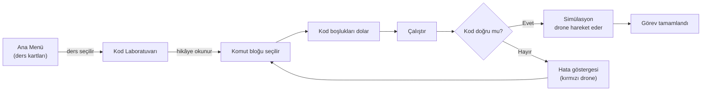

# Neuracode AI


-3DDC84?logo=android&logoColor=white)


**Neuracode AI**, 8-15 yaş arası çocukların ve gençlerin **klavye kullanmadan**, tarım temalı bir oyun içinde Python programlamayı ve yapay zekâ kavramlarını öğrendiği Android uygulamasıdır. En düşük segment cihazlarda (2 GB RAM) bile akıcı çalışmayı hedefler.

Kullanıcı, ekrandaki kod bloklarına dokunarak satır numaralı Python kodundaki boşlukları doldurur ve **Çalıştır**'a bastığında sağdaki simülasyon panelinde tarım dronu kodun mantığına göre hareket eder. Kod yanlışsa drone kırmızıya döner, doğruysa görev tamamlanır.

## Öğrenme Döngüsü



Her ders üç aşamadan oluşur:

1. **Hikâye**: Konu, çocuğun günlük hayatından bir benzetmeyle anlatılır (örn. döngü için "merdiven çıkarken 20 basamakta aynı hareketi yapmak").
2. **Kod Tamamlama**: Hazır Python kodundaki kritik boşluklar, alttaki komut bloklarıyla doldurulur. Yanlış blok geri alınabilir.
3. **Simülasyon**: Kod çalıştığında drone Canvas üzerinde hareket eder, hedefe ulaşınca görev tamamlanır.

## Ekranlar

### Ana Menü (HomeScreen)

Ders kartlarının 4 sütunlu grid halinde listelendiği giriş ekranı. Hamburger menüden açılan çekmecede **koyu tema** ve **ses ayarları** anahtarları (çalışır durumda), ayrıca ödüller, font özelleştirme ve öneri kutusu girişleri yer alır.

### Kod Laboratuvarı (CodeLabScreen)

Uygulamanın kalbi; yatay modda çalışan, ikiye bölünmüş öğrenme ekranı:

| Bölge | İşlev |
|---|---|
| Üst şerit | Ders başlığı (örn. "5. If/Else Kararları") |
| Hikâye kutusu | Konuyu benzetmeyle anlatan kısa metin |
| Sol panel | Satır numaralı Python kodu, dokunmatik boşluk doldurma alanları |
| Sol alt | Komut blokları + **Geri** ve **Çalıştır/Durdur** butonları |
| Sağ panel | Canvas simülasyonu: ızgara zemin, ders bazlı hedefler (engel, bitkiler), drone karakteri |
| En alt | Navigasyon çubuğu: geri/ileri, ses, müzik, ayarlar |

Ayarlar düğmesi, arka planı bulanıklaştıran yarı saydam bir ayarlar kartı açar (dil, ses anahtarı, öneri kutusu, devam et).

## Mimari

Uygulama, MVVM desenini ve Compose'un bildirimsel durum yönetimini kullanır:

```mermaid
flowchart TB
    subgraph UI["Compose UI Katmanı"]
        Home["HomeScreen<br/>ders kartları + çekmece menü"]
        Lab["CodeLabScreen<br/>bölmeli öğrenme ekranı"]
    end
    subgraph VM["ViewModel Katmanı"]
        VM["CodeLabViewModel<br/>durum yönetimi + simülasyon motoru"]
    end
    subgraph DATA["Veri Katmanı"]
        Repo["LessonRepository<br/>13 bölüm / 15 ders"]
    end
    Home -- "onLessonClick(lessonId)" --> Lab
    Lab -- "loadLesson() / onCommandBlockClick()" --> VM
    VM --> Repo
```

- **`LessonRepository`**: Tüm dersleri (başlık, hikâye, kod satırları, komut blokları) bellekte tutan tekil (singleton) veri kaynağı.
- **`CodeLabViewModel`**: Aktif dersin kod satırlarını, simülasyon durumunu (IDLE / RUNNING / SUCCESS / ERROR) ve drone konumunu (`droneX`, `droneY`) yönetir. Boşluk doldurma, geri alma ve ders bazlı animasyon akışları burada yürür.
- **`AppSettings`**: `CompositionLocal` ile tüm ağaca enjekte edilen çalışma anı ayarları (koyu tema, ses).

## Müfredat

Mevcut içerik 13 bölüm ve 15 dersten oluşur; her kavram bir benzetmeyle tanıtılır:

| # | Ders | Python Kavramı | Benzetme |
|---|---|---|---|
| 1 | İlk Komut | Fonksiyon çağrısı | Köpeğe "otur" demek |
| 1 | Görev 1 (Bronz) | Sıralı komutlar | Kalk → in |
| 2 | Yön Bulma | Parametreli komut | Evden okula yürümek |
| 2 | Görev 1 (Bronz) | İleri/geri | Başlangıca dönmek |
| 3 | Dönme Açısı | Açı parametresi | Saat ibresi, dönme dolap |
| 4 | For Döngüsü | `for i in range()` | Merdiven çıkmak |
| 5 | If/Else | Koşullu ifade | Yağmurluysa şemsiye al |
| 6 | Değişkenler | Atama | Kumbara |
| 7 | While Döngüsü | Koşullu tekrar | Kova dolana kadar su |
| 8 | Fonksiyonlar | `def` | Bulaşık makinesinin "Yıka" tuşu |
| 9 | Parametreli Fonksiyonlar | Argüman | Akıllı fırına süre/derece vermek |
| 10 | Listeler | `list`, `for ... in` | Alışveriş listesi |
| 11 | İç İçe Döngüler | Nested loops | Tarlayı satır satır süren traktör |
| 12 | Sensörler | Nesne/metot | Drone'un gözleri |
| 13 | Görev Planlama | Veri yapısında döngü | Yemek tarifi sırası |

## Teknoloji Yığını

| Katman | Teknoloji | Durum |
|---|---|---|
| Dil | Kotlin 2.0.21 | Kullanımda |
| UI | Jetpack Compose (BOM 2024.12.01) + Material Design 3 | Kullanımda |
| Mimari | MVVM + Navigation Compose 2.8.5 | Kullanımda |
| Simülasyon | Compose Canvas | Kullanımda (temel) |
| Uygulama içi Python | Chaquopy | Planlanan |
| Yapay zekâ | TensorFlow Lite (TinyML, INT8) | Planlanan |
| Animasyon | Lottie Compose 6.6.2 | Bağımlılık hazır |

- `minSdk 24` (Android 7.0+), `targetSdk/compileSdk 35`, JDK 17
- Yatay (landscape) moda kilitli, edge-to-edge destekli

## Depo Yapısı

```
Neuracode-AI/
├── Neuracode AI/                    # Proje dokümantasyonu (Obsidian vault)
│   ├── 01_Projeler/Neuracode-AI/    # Ana Plan v3.0, teknik iskelet, yol haritası, UI analizi
│   ├── 03_Kaynaklar/                # Kavram notları (Agri-Drone, TinyML, Sıfır Klavye...)
│   ├── Ara yüz/                     # El çizimi ekran taslağı (Excalidraw)
│   ├── Excalidraw/                  # Diyagramlar
│   ├── Proje_Ozeti.md               # Tek sayfalık proje özeti
│   └── Yapilan_Islemler.md          # Geliştirme günlüğü
├── NeuracodeAI_App/                 # Android uygulaması (Kotlin + Jetpack Compose)
└── claudesidian-vault/              # Claudesidian (Claude Code + Obsidian) starter kit vault'u
```

## Kurulum

Gereksinimler: Android Studio (Ladybug+), JDK 17, Android SDK 35.

```bash
cd NeuracodeAI_App
gradlew.bat assembleDebug   # Windows
./gradlew assembleDebug     # macOS / Linux
```

APK çıktısı `NeuracodeAI_App/app/build/outputs/apk/debug/` altında oluşur. Alternatif olarak `NeuracodeAI_App` klasörünü Android Studio ile açıp emülatör veya cihazda çalıştırabilirsiniz.

## Yol Haritası

- [ ] Emülatör/gerçek cihazda uçtan uca test
- [ ] Simülasyon motorunun zenginleştirilmesi: drone sprite'ı, tarla çizimi, ders bazlı hedefler
- [ ] Giriş seviyesi cihazlarda 60 FPS performans testleri
- [ ] Dersler ekranı ve pedagojik içerik yapısı
- [ ] 8-15 yaş hedef kitlesi için eğitim görevlerinin tamamlanması
- [ ] Chaquopy ile gerçek Python çalıştırma
- [ ] TensorFlow Lite (TinyML) entegrasyonu

## Dokümantasyon

Ayrıntılı plan ve tasarım dokümanları `Neuracode AI/` altındaki Obsidian vault'undadır:

| Doküman | İçerik |
|---|---|
| [Proje_Ozeti.md](Neuracode%20AI/Proje_Ozeti.md) | Tek sayfalık özet: fikir, araçlar, tasarım, teknoloji, gelir modeli |
| [Ana_Plan.md](Neuracode%20AI/01_Projeler/Neuracode-AI/Ana_Plan.md) | Master Plan v3.0: vizyon, müfredat, teknik mimari, yayın stratejisi |
| [00_Genel_Bakis.md](Neuracode%20AI/01_Projeler/Neuracode-AI/00_Genel_Bakis.md) | Proje kontrol paneli: durum, sürümler, açık konular |
| [Teknik_Yol_Haritasi.md](Neuracode%20AI/01_Projeler/Neuracode-AI/Teknik_Yol_Haritasi.md) | 8 fazlı geliştirme planı |
| [UI_Tasarim_Analizi.md](Neuracode%20AI/01_Projeler/Neuracode-AI/UI_Tasarim_Analizi.md) | Mockup ekranlarının detaylı analizi |
| [Ara yüz/ana_ara_yüz.md](Neuracode%20AI/Ara%20y%C3%BCz/ana_ara_y%C3%BCz.md) | Uygulamanın el çizimi ekran taslağı |
